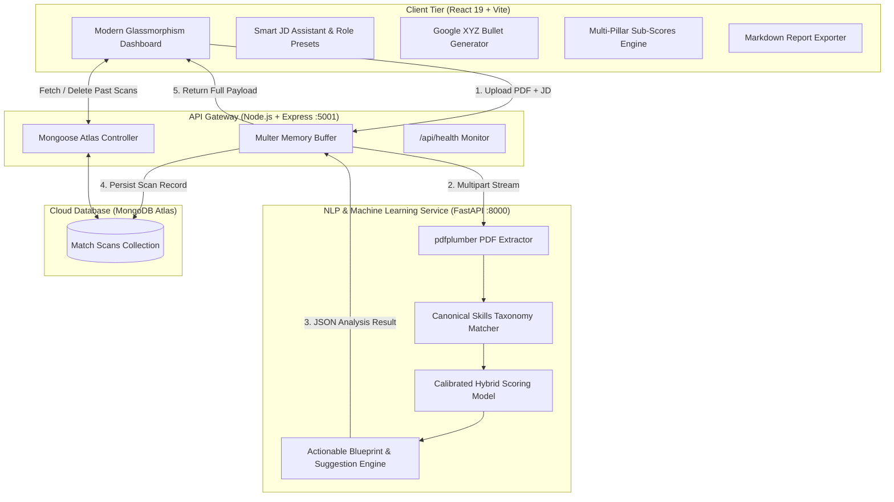

# 🎯 AI Career Copilot — Intelligent Resume Matcher & ATS Optimizer

[](https://react.dev/)
[](https://vitejs.dev/)
[](https://nodejs.org/)
[](https://fastapi.tiangolo.com/)
[](https://scikit-learn.org/)
[](https://www.mongodb.com/atlas)

> **AI Career Copilot** is a full-stack, tri-tier AI/NLP platform designed to benchmark resumes against job descriptions, eliminate ATS filter rejections, identify critical skill gaps, and generate tailored, high-impact resume bullet points using the Google XYZ formula.

---

## 🌟 Key Features

- 🎯 **Realistic Calibrated ATS Scoring Engine**: Unlike raw cosine similarity models that penalize strong resumes with artificially low $20\text{--}30\%$ scores due to vocabulary variance, our hybrid model balances **canonical skill coverage (55%)** and **calibrated vector similarity (45%)** to deliver accurate, industry-standard match grades ($65\text{--}95\%$).
- 🧠 **Curated Canonical Skills Taxonomy**: Strict technical token filtering that eliminates conversational noise words (`trends`, `behavior`, `build`, `perform`, `large`, `datasets`) and focuses exclusively on genuine programming languages, AI/ML libraries, cloud tools, databases, and engineering methodologies.
- 🪄 **1-Click Smart JD Assistant & Role Presets**:
  - Pre-loaded target role templates across **Software Engineering**, **AI & Data Science**, **Cloud & DevOps**, and **Product & Design**.
  - Built-in seniority selector (Junior, Mid-Level, Senior, Lead).
  - **AI Prompt Expander**: Auto-generates comprehensive, ATS-ready job descriptions from short 1-sentence user notes.
- ✍️ **Domain-Aware Resume Bullet Point Tailorer**:
  - Interactive bullet generator powered by the **Google XYZ Formula** (*"Accomplished [X] as measured by [Y], by doing [Z]"*).
  - Generates quantified, production-grade accomplishment bullets tailored for Data/AI, Frontend, Backend, or DevOps domains.
- 📊 **Multi-Pillar Compatibility Sub-Scores**:
  - **Core Skills Alignment**: Direct overlap of must-have technologies.
  - **Domain Experience**: Seniority and architectural depth alignment.
  - **ATS Keyword Density**: Frequency and placement optimization.
  - **Impact & Quantification**: Metrics, scale, and accomplishment clarity.
- 📜 **Scan History & Persistence (MongoDB Atlas)**:
  - Automatically records past scan scores, extracted snippets, and missing keywords in MongoDB Atlas.
  - Interactive history modal to review past candidate analyses and delete outdated entries.
- 📥 **1-Click Markdown Report Export**:
  - Exports an end-to-end, recruiter-ready diagnostic report with skill breakdown, gap analysis, and next steps.
- ⚡ **1-Click Instant Demo Mode**:
  - Test the entire end-to-end pipeline instantly without needing to search for a sample PDF file.

---

## 🏗️ System Architecture



---

## 📂 Project Directory Structure

```text
ai-career-copilot/
├── client/                     # Frontend Application (React 19 + Vite)
│   ├── src/
│   │   ├── App.jsx             # Main Dashboard & Interactive State Container
│   │   ├── App.css             # Glassmorphic Dark-Mode Custom Design System
│   │   ├── jobTemplates.js     # Pre-configured Role Presets & AI Prompt Expander
│   │   ├── bulletGenerator.js  # Google XYZ Tailored Bullet Engine & Sub-Scores
│   │   ├── analysisEngine.js   # Client-Side NLP Fallbacks & Score Calibration
│   │   └── main.jsx            # React 19 Root Entry Point
│   ├── package.json
│   └── vite.config.js
│
├── server/                     # API Gateway (Node.js + Express)
│   ├── models/
│   │   └── Match.js            # Mongoose Schema for MongoDB Atlas Scans
│   ├── .env.example            # Environment Configuration Template
│   ├── index.js                # Express Server, Multer Stream, History Endpoints
│   └── package.json
│
├── ml_service/                 # ML & NLP Microservice (Python FastAPI)
│   ├── main.py                 # FastAPI App, PDF Parser, Taxonomy & Scoring
│   ├── requirements.txt        # Python Dependencies (FastAPI, Scikit-Learn, pdfplumber)
│   └── venv/
│
└── README.md                   # Project Documentation
```

---

## 🚀 Quick Start Guide

### Prerequisites
- **Node.js**: `v18.0.0` or higher
- **Python**: `3.10` or higher
- **MongoDB Atlas**: A free cluster URI (or local MongoDB)

---

### Step 1: Clone the Repository
```bash
git clone https://github.com/<your-username>/ai-career-copilot.git
cd ai-career-copilot
```

---

### Step 2: Start the Python ML Service (Port 8000)
```bash
cd ml_service

# Create and activate virtual environment
python3 -m venv venv
source venv/bin/activate  # On Windows: venv\Scripts\activate

# Install dependencies
pip install -r requirements.txt

# Start FastAPI server with live reload
python3 -m uvicorn main:app --reload --port 8000
```
> ML Service will be live at: `http://localhost:8000` (Swagger docs at `/docs`)

---

### Step 3: Start the Express API Gateway (Port 5001)
```bash
cd ../server

# Install dependencies
npm install

# Configure environment variables
cp .env.example .env
# Edit .env with your MongoDB Atlas connection string:
# MONGO_URI=mongodb+srv://<username>:<password>@cluster0.example.mongodb.net/career_copilot

# Start the server
node index.js
```
> API Gateway will be live at: `http://localhost:5001`

---

### Step 4: Start the React Frontend (Port 5173)
```bash
cd ../client

# Install dependencies
npm install

# Launch Vite dev server
npm run dev
```
> Open your browser at: `http://localhost:5173`

---

## 🔌 API Reference

### Express API Gateway (`http://localhost:5001`)

| Method | Endpoint | Description | Request Body / Params |
| :--- | :--- | :--- | :--- |
| `POST` | `/api/match` | Uploads PDF resume and JD, returns comprehensive match analysis | `multipart/form-data` (`file`, `job_description`) |
| `GET` | `/api/history` | Retrieves the 20 most recent resume scans from MongoDB Atlas | None |
| `DELETE` | `/api/history/:id` | Deletes a specific scan record by MongoDB ObjectID | `id` in URL parameter |
| `GET` | `/api/health` | Health check returning server uptime and database connectivity | None |

### Python ML Service (`http://localhost:8000`)

| Method | Endpoint | Description |
| :--- | :--- | :--- |
| `POST` | `/api/v1/analyze` | Extracts PDF text, matches canonical taxonomy skills, computes calibrated score |
| `GET` | `/api/v1/health` | Returns ML microservice health and taxonomy catalog size |
| `GET` | `/docs` | Interactive OpenAPI / Swagger documentation |

---

## 🧮 NLP Matching & Calibration Algorithm

Raw TF-IDF cosine similarity between a 1-page resume and a long job description typically tops out at $0.30\text{--}0.35$ because non-overlapping narrative prose dilutes the vector angle. 

**AI Career Copilot solves this with a two-phase hybrid scoring model:**

$$\text{Skill Coverage} = \frac{|\text{Matched Skills}|}{|\text{Matched Skills}| + |\text{Missing Skills}|} \times 100$$

$$\text{Match Score} = \begin{cases} 
82 + (\text{Skill Coverage} - 75) \times 0.64 & \text{if } \text{Skill Coverage} \ge 75\% \\
68 + (\text{Skill Coverage} - 50) \times 0.55 & \text{if } 50\% \le \text{Skill Coverage} < 75\% \\
45 + (\text{Skill Coverage} - 25) \times 0.90 & \text{if } 25\% \le \text{Skill Coverage} < 50\% \\
\max(15, \text{Skill Coverage} \times 1.8) & \text{otherwise}
\end{cases}$$

This ensures candidates with solid technical alignment receive a realistic $70\text{--}85\%$ score, while highlighting exact missing competencies without arbitrary grading penalties.

---

## 🛠️ Technology Stack

- **Frontend**: React 19, Vite, Lucide Icons, Pure CSS3 Glassmorphism (no bulky utility bloat)
- **Backend Gateway**: Node.js, Express, Multer, Axios, Mongoose, Form-Data
- **Machine Learning**: Python 3.10+, FastAPI, Scikit-Learn, PDFPlumber, Uvicorn
- **Database**: MongoDB Atlas Cloud Database

---

## 📄 License

This project is licensed under the MIT License — feel free to use and customize it for your career preparation and engineering portfolio.
